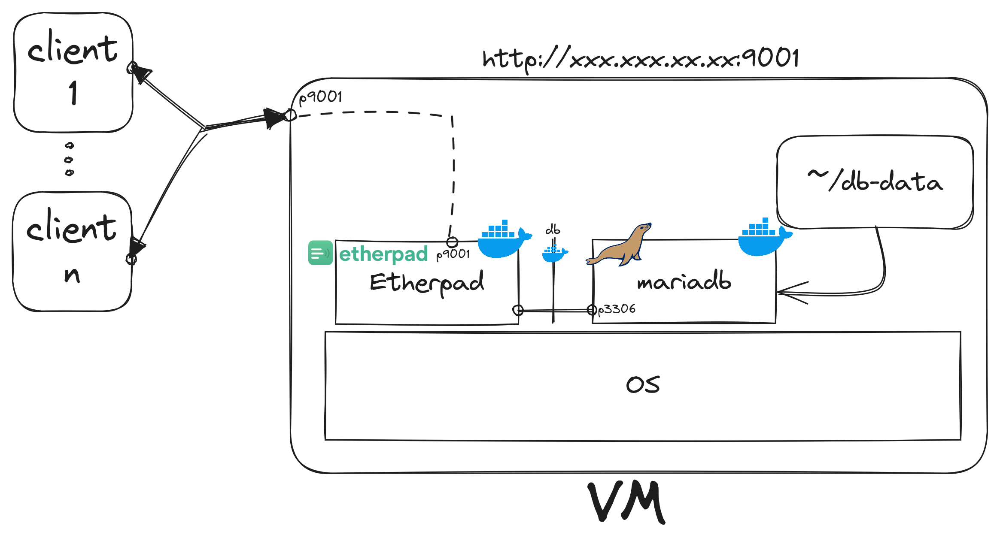

# Etherpad Deployment

## Abstract

This report provides a detailed walk-through of our process to **deploy an instance of Etherpad** on Oracle Cloud using Docker. We discuss the steps involved from **cloning** the Etherpad repository, **configuring it**, **building a personalized Docker image** and **creating** a *Docker Compose* file for the Etherpad and MariaDB containers.

## Table of Contents

1. [Introduction](#introduction)
2. [Pre-requisites](#pre-requisites)
3. [Cloning the Etherpad Repository](#cloning-the-etherpad-repository)
4. [Configuration of the Etherpad](#configuration-of-the-etherpad)
5. [Building the Docker Image](#building-the-docker-image)
6. [Creating the Docker Compose File](#creating-the-docker-compose-file)
7. [Deploying Etherpad on Oracle Cloud](#deploying-etherpad-on-oracle-cloud)
8. [Accessing the Etherpad Instance](#accessing-the-etherpad-instance)
9. [Conclusion](#conclusion)

## Introduction

In this report, we outline the steps we took to deploy an Etherpad instance on Oracle Cloud using Docker. This is a simple Overview of the full project:



## Pre-requisites

Before beginning the deployment, we ensured that the following requirements were met.

- A Cloud Provider account 
> we used [Oracle Cloud](https://cloud.oracle.com/) because it offers good free tier options.
- A VM with Docker installed (recommended [Alpine Linux](https://alpinelinux.org/downloads/)).

## Cloning the Etherpad Repository

After login in our VM instance, we started by cloning the Etherpad repository from Github.

```bash
git clone https://github.com/ether/etherpad-lite.git
```

## Configuration of the Etherpad

We then modified the configuration file to suit our needs:
1. Enable the authentication system

[settings.json.docker](./config-files/settings.json.docker)

> We added the authentication and a new user

## Building the Docker Image

We built a Docker image:

```bash
docker build --tag personalized/etherpad .
```

## Creating the Docker Compose File

Next, we created a Docker Compose file to manage our Etherpad and MariaDB containers. 

[docker-compose.yml](./config-files/docker-compose.yml)

> We added the official [MariaDB container](https://hub.docker.com/_/mariadb) and the environment variables

> The `depends_on` option in your Docker Compose specifies that the `etherpad` service is started after the `db` service.

> Note: Docker Compose **automatically sets up a network** for each service and each one is reachable at a hostname identical to the service name. So, in this case, `db` is the hostname that the `etherpad` service uses to **connect** to the database.

## Deploying Etherpad on Oracle Cloud

We then deployed the Etherpad instance on Oracle Cloud machine: 

```bash
docker-compose up -d
```

## Accessing the Etherpad Instance

To access the deployed Etherpad instance, navigate to the service http://129.151.251.123:9001/ in your web browser.

## Conclusion

In this report, we drafted a the process to deploy a simple Etherpad instance and provided instructions on how to access it.
