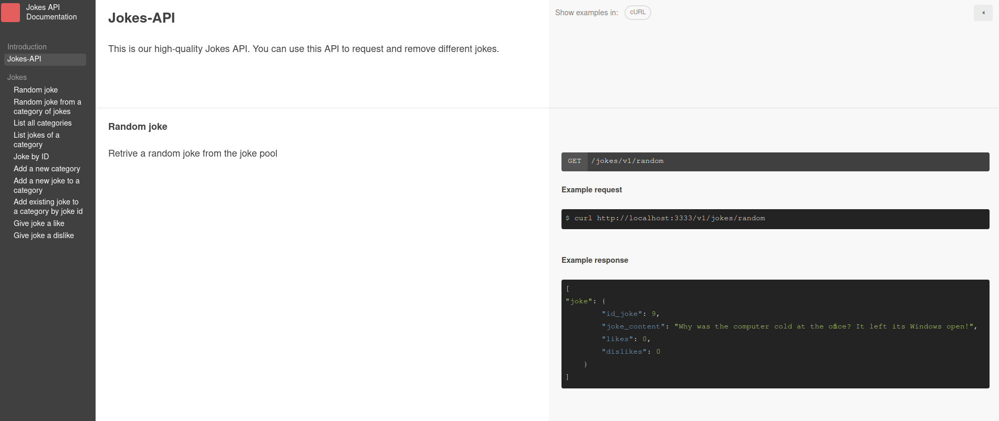
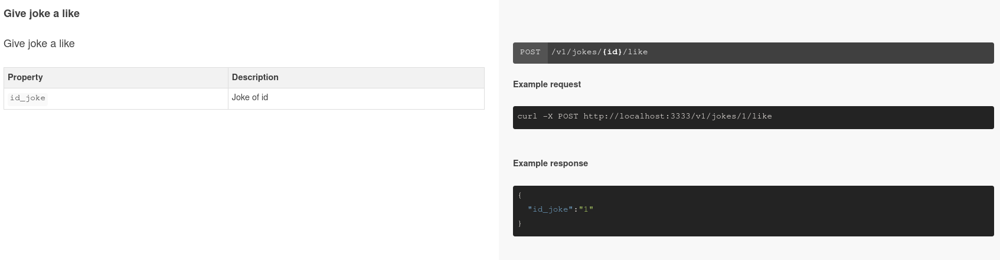
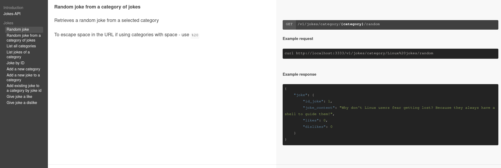
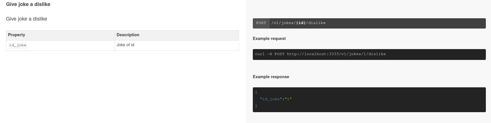
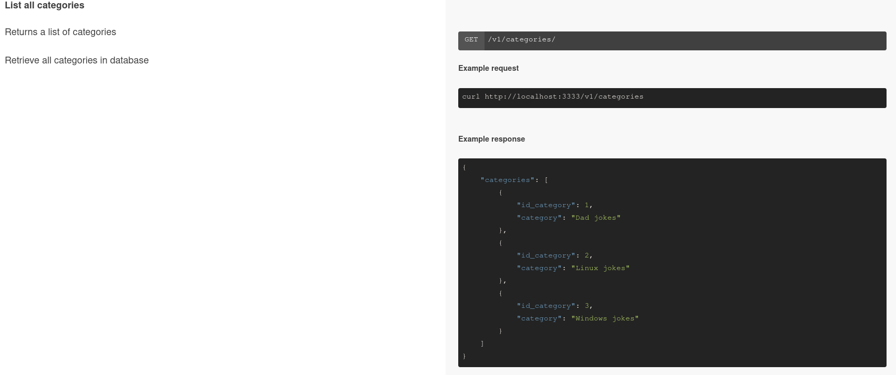

## Introduction

This is a simple project that implements an API to manage a list of jokes. 
The API is implemented using the express framework and the data is stored in a SQLite database, so no additional setup is required to run the database.

## Structure of the project

The project is structured as follows:

```
.
├── docbox
│  └── (source code of docbox)
├── app.js
├── database.js
├── routes
│  └── v1.js
├── jokes.db.example
├── package.json
└── README.md
```
> Note: jokes.db.example is an example of the database that has jokes already inserted. (remove .example to use it).

## Hosting
Our API is hosted in a VM in the Google Cloud Platform. For running our two services, we use the following commands:

```bash 
pm2 start app.js
cd docbox
pm2 start npm -- start
```

## Documentation











