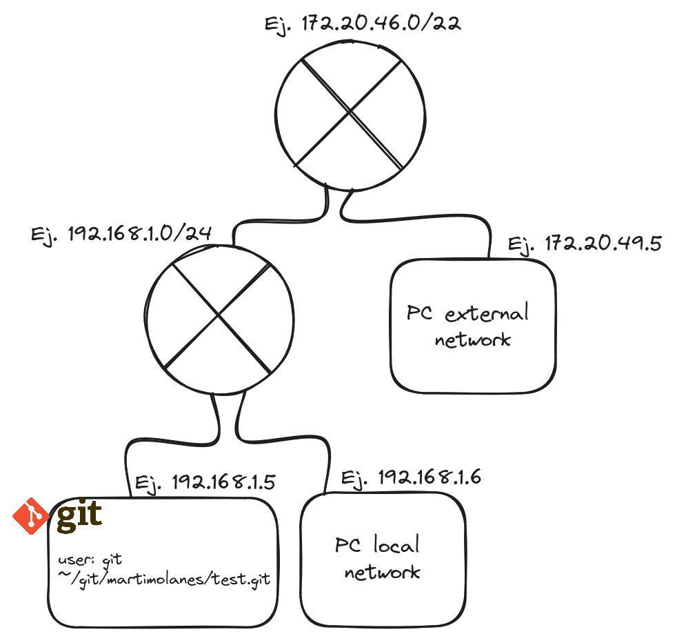

# Git Server

## Abstract


## Table of Contents

1. [Introduction](#introduction)
2. [Pre-requisites](#pre-requisites)
3. [Git Server Configuration](#git-server-configuration)
4. [Building UI](#building-the-UI)
5. [Accessing Git Server](#accessing-git-server)
6. [Conclusion](#conclusion)

## Introduction

In this report, we outline the steps we took to deploy a Git Server.
The specificacion of the server is as follows:
- We need to have a Git Server that is accesible via ssh from private network and also public, **but only** the private network can access with password, the public network can only access with ssh-keys.
- The server should have a web interface to manage the repositories.

This is a simple Overview of the full project:



With this Topology we are replicating the connection of a private network and a public network to the server, adding one extra router to our 
private network to simulate the connection to the internet. So, every connection from the public network to the server will be through the router.

## Pre-requisites

Before beginning the deployment, we ensured that the following requirements were met.

- Recreate the topology.
- A linux server with git installed and connected to the private network.
- A router connected to the private network and the public network.
- Device connected to the public network to test the connection to the server.
- Device connected to the private network to test the connection to the server.

## Git Server Configuration

With a superuser account:
1. Create a new user for git
```bash
adduser git
# change the shell to git-shell
chsh -s /usr/bin/git-shell git
```

2. Create a new directory for the repositories
```bash
mkdir /home/git/repositories
chown git:git /home/git/repositories
```


## Building the UI

We will use `cgit` to build the web interface for the git server.

1. Install docker
```bash
sudo snap install docker
```

2. Run the cgit container
[ClearLinux cgit image](https://hub.docker.com/r/clearlinux/cgit#!)
[ClearLinux cgit Dockerfile](https://github.com/clearlinux/dockerfiles/blob/master/cgit/Dockerfile)
```bash
docker run --network host -v /home/git/repositories:/var/www/cgit -d --name cgit clearlinux/cgit
```
> Note: this Dockerfile is not only running cgit, it is also running apache2 web server.


## Accessing Git Server


### Accessing UI

To access the web interface, open a web browser and navigate to `http://<server-ip>/cgit`.


## Conclusion


