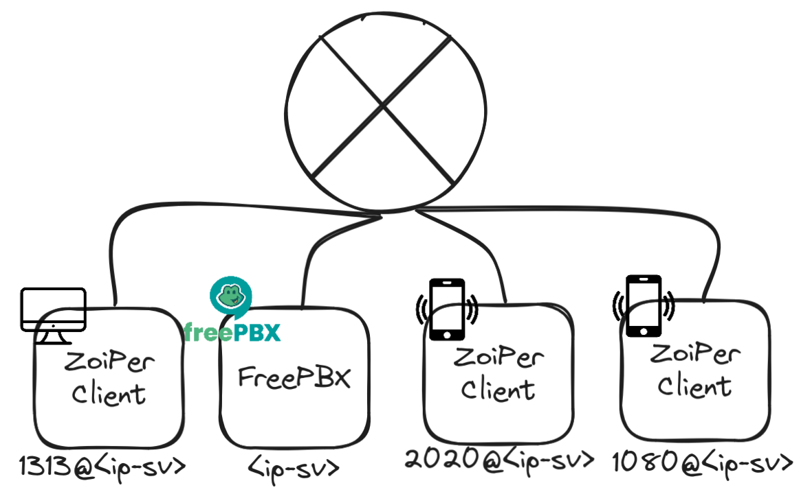

# FreePBX and Zoiper

## Abstract

This report presents the process of setting up a FreePBX which is a GUI that manages Asterisk to use Voice over Internet Protocol (VoIP) and telephony server and also Zoiper which is a software application that provides VoIP functionality for desktop computers and mobile devices. It supports SIP (Session Initiation Protocol) which signals and enables connection between endpoints and manages elements of the call.

## Table of contents

1. [Introduction](#introduction)
2. [Pre-requisites](#pre-requisites)
3. [VoIP service on the private network](#voip-service-on-the-private-network)
4. [Setting up FreePBX](#setting-up-freepbx)
5. [Setting up Zoiper](#setting-up-zoiper)
6. [Issues with the FreePBX server](#issues-with-the-freepbx-server)
7. [Conclusion](#conclusion)

## Introduction

In this report we provide the steps we took to setup the FreePBX and Zoiper client.

The specific steps are as follows:
- Set up a FreePBX server on a virtual machine
- Create extentions (Users) on the server.
- Set up the Zoiper client on a mobile device and a desktop computer. 

## Pre-requisites

Before using the Zoiper client, you need to have the following:

- A virtual machine with FreePBX installed and running.
- A mobile device or a desktop computer.
- Devices connected to the same network as the FreePBX server.

## VoIP service on the private network

## Setting up FreePBX

1. Install FreePBX from the official website [here](https://www.freepbx.org/downloads/).

2. Set up a virtual machine with FreePBX ISO.

Now you can access the server and set up the users for the Zoiper client in the WEB UI.

> Follow the administration guide on how to set up the users for the Zoiper client [here](guide-administrator.md).

## Setting up Zoiper

To set up the Zoiper client you can follow the user guide [here](guide-user.md).

## Issues with the FreePBX server

After running the virtual machine and logging in to the linux server, we have encountered the following issues:

- After 5 minutes of running, FreePBX would enable its firewall which would block from accessing the WEB UI.

- The network adapter is set to Bridged mode, but the server was not accessible from the host machine.

> To solve this issue we have disabled `Fail2Ban` service with a command `service fail2ban stop`.

## Conclusion

In this report we have presented the process of setting up a FreePBX server and Zoiper client. We have also encountered some issues with the FreePBX server and provided the solution to the issues.
