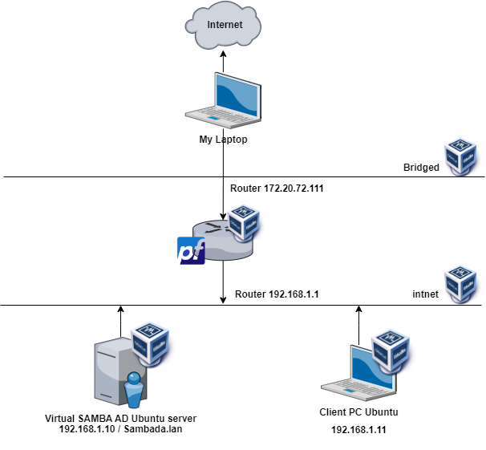
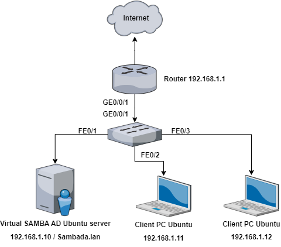

# Deployment of a Corporate Private Network
## Abstract
This report details process of deploying a private network in Linux. The objective was to simulate a real-world corporate network environment, providing valuable insights into network setup, management, and troubleshooting. Key findings include the critical role of meticulous planning in network deployment, the importance of understanding the interplay between different network components, and the challenges and solutions involved in configuring network services.

## Table of Contents
1. [Introduction](#introduction)
2. [Virtual Deployment](#virtual-deployment)
3. [Real Deployment](#real-deployment)
4. [Network Services](#network-services)
5. [Conclusion](#conclusion)
6. [Appendix](#appendix)

## Introduction
This report presents the design and deployment of a private network, both virtually and physically, for a simulated corporate environment. Using VirtualBox, pfSense, Ubuntu, and Cisco hardware, we established a network comprising two PCs, a SAMBA server, and a client.

## Virtual Deployment
For the Virtual Deployment, we used VirtualBox to create 4 VMs: 1 Ubuntu Server (SAMBA/AD server), 1 pfSense (router), and 1 Ubuntu Desktop (another client).

The topology of the network is as follows:

> Bridged Adapter: Used for connecting pfSense to internet if it were a real router. The connection through the host machine is transparent. Note: We could have used NAT.

> inet (Internal Network): Used for connecting VMs to each other.

## Real Deployment
For the Real Deployment, we used Cisco hardware to create a network with 2 PCs (1 SAMBA/AD server, and 1 client).

The topology of the network is as follows:

> Note: The topology is the same as the virtual network, except that the pfSense router is replaced with a Cisco router.
## Network Services
- Detailed explanation of the network services deployed (DHCP, SAMBA/AD, pfSense).
- Explanation of how these services were configured and deployed.

## Conclusion
- Summary of the project and the key findings.
- Discussion of the lessons learned and potential improvements for future projects.

## Appendix
